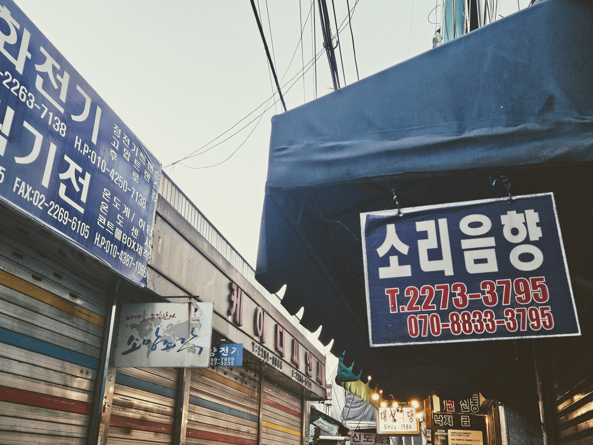
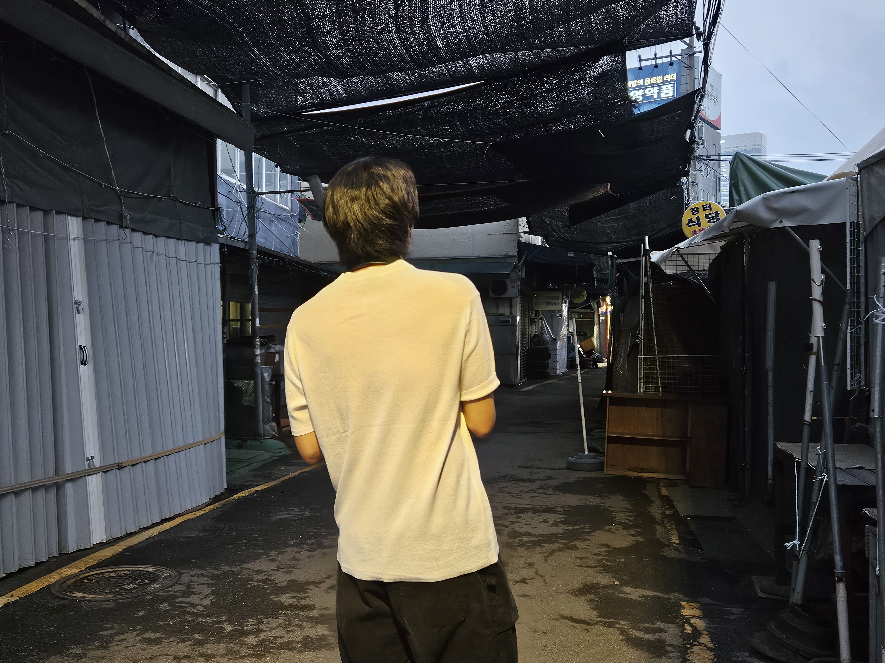

기자가 되고 싶어 바이라인네트워크라는 회사에 지원했다. IT 전문지인데, 기사의 질도 높고 업계에서 인지도도 있는 매체다. 연락이 한참 안 오길래 서류 탈락인 줄 알았는데 뜬금없이 그저께 메일이 왔고, 오늘 면접을 봤다. 횡설수설하고 나왔다. 아니나 다를까, 서른이 다 되도록 그 흔한 인턴 한번 안 해본 이유를 설명해야 했다. 20대에, 학생 신분으로 경험할 수 있는 건 다 해보고 싶어서 이것저것 하느라 그랬다고 했다. 말이야 에둘러 했지만 그냥 놀았지 뭐. 사실 나라도 안 뽑을 것 같긴 하다. 대학교 동아리도 아니고 이런 놈을 뭘 믿고 뽑나.

저녁엔 고등학교 친구를 만났다. 취준한다고 고생이 많은 친구다. 세운상가 근처 골목길에 위치한 대성식당에서 낙곱새에 소맥을 한 잔 했다. 기자 되겠다니까 잘 생각했다고 한다. 고등학교 때 내가 쓴 글을 좋아했던 고마운 친구다. 오랜만에 술 먹으니 참 달더라. 해가 길어져서 다 먹고 나와도 날이 밝았다.

  
  ▲ 20260319, 종로 대성식당 앞

애저녁부터 알딸딸한 채 청계천을 걸으니 작년 이맘때쯤 생각이 났다. 5월이었나, 군대 친구와 종로 일대에서 낮술 조졌었는데. 우래옥에서 평양냉면에 소주 한 병씩 하고, 영덕회식당이라는 노포에 가서 두 병씩인가 더 마셨다. 거기 막회랑 초장 양념이 죽인다. 먹다가 양념을 쏟아서 흰 반팔티가 난리가 났는데, 기분이 좋아서 딱히 신경이 안 쓰였다. 가게를 나와서 초장으로 빡세게 프린팅한 티를 입고 종로 일대를 활보했다. 한참을 걸었다. 해방감을 느꼈던 게 기억난다. 동묘에 잠깐 들렀다가 3차로 광장시장 가서 육회 시켜놓고 소주 한 병 더 했다. 만취해서 집에 갔다.

  
  ▲ 20250515, 동묘

그런 날이 또 있을까? 오늘 청계천에서 그런 생각을 했다.