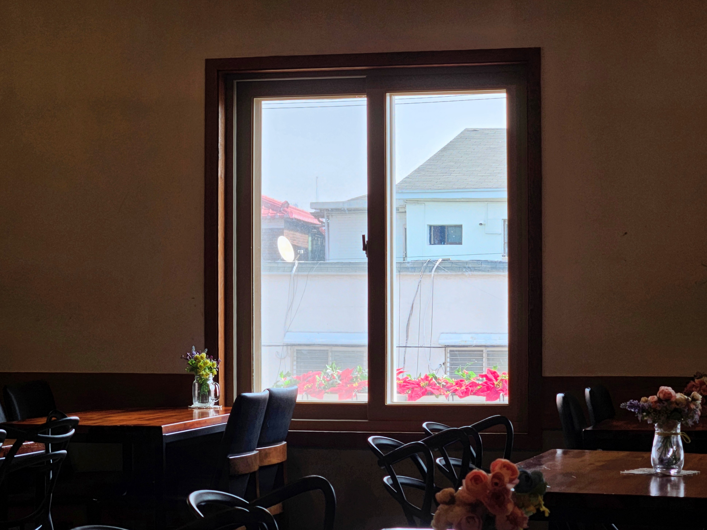

동네에 다닐 만한 카페가 있다는 건 다행인 일이다. 한 뼘 짜리 방에 사는 백수에게는 특히 그렇다. 카페 아니면 우울증이다.

다닐 만한 카페라 함은 널찍해야 하고, 콘센트 딸린 좌석이 많아야 하며, 너무 붐비지도 않아야 하고, 오래 있어도 눈치가 안 보여야 한다. 이 조건들을 충족하는 개인 카페가 잘 없어서 프랜차이즈를 주로 가게 된다. 커피 맛은 잘 몰라서 상관 없다.

내가 사는 곳 근처에는 걸어서 10분 안쪽 거리에 프랜차이즈 카페가 없다. 15분에서 20분쯤 걸으면 스타벅스가 나오긴 하는데, 이게 심리적으로 꽤 장벽이 생기는 거리다. 오늘은 유난히 걷기가 싫어서 집 근처 카페를 다시 한 번 꼼꼼히 검색해봤다. 그리고 카페 올리브라는 곳을 찾아냈다.

  
  ▲ 20260323, 카페 올리브 내부

여긴 미쳤다. 층고 높은 석조 교회 건물에, 자리도 많고, 사람도 없다. 무엇보다 스타벅스에는 없는 여유가 있다. 사장님이 테이블에 앉아서 친구들과 수다 떠는 그런 카페다. 또래가 많은 곳은 각박하다. 역시 아줌마 아저씨들이 있어야 마음이 편안해진다.

왜 몰랐을까. 앞으로 자주 갈 듯하다.