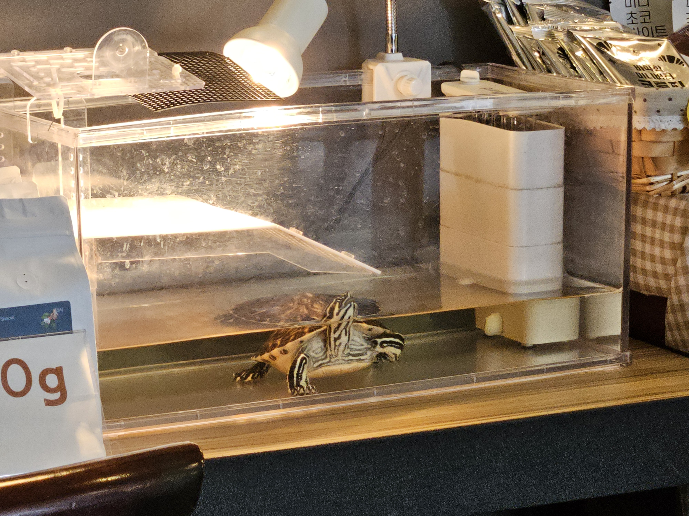

어제 맘에 드는 카페를 찾아서 이참에 기세를 몰아 주변의 다른 카페들도 몇 군데 더 들러보기로 했다. 오늘 갔던 곳은 통유리문을 열어놓은 개방형 카페였다. 학교 끝나고 와서 숙제하는 중학생부터 아이와 함께 온 젊은 엄마들, 두꺼운 카드지갑 케이스를 쓰는 할머니들이 다녀갔다.

그리고 거북이도 있었다.

  
  ▲ 20260324, 카페에서 본 거북이

얘를 쳐다보느라 하던 일에 집중을 못했다. 신기하거나 예뻐서가 아니라 불쌍해서다. 저 통 안에 갇혀서 내내 앞으로 헤엄치고 있더라. 그러면 밖으로 나가지는 줄 아나보다. 걷다가 조금 지치는가 싶으면 머리를 길게 빼서 물 밖을 보다가, 이내 다시 다리를 휘적휘적 젓는다. 그걸 반복하며 몇 시간 동안 제자리걸음을 한다.

더 안타까운 건 쟤가 바깥 세상에 반응한다는 거였다. 가까이 가면 고개를 돌려 쳐다보고, 움직이면 시선이 따라온다. 사람들도, 화분도, 밖에 지나다니는 차들도 다 보일 텐데. 걸어도 가까워지지 않으니 이상하겠지.

요샌 어떨지 모르지만 예전에 시골에 가면 철제 케이지 안에 사는 개들이 있었다. 꼭 그런 거 보는 기분이었다.

거북이가 그 안에 몇 주, 몇 달, 아니면 몇 년 동안 살았을까. 어쩌면 카운터 뒤쪽이나 주인 아주머니 집 안에 조금 더 넓은 수조가 있어서 카페 문 닫으면 거기로 돌아갈까. 그랬으면 좋겠다.