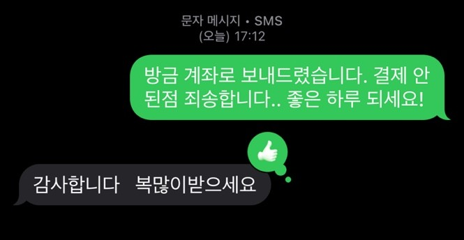

며칠 전 친구의 청첩장 모임에서 새벽까지 술을 마셨다. 귀가할 때 신촌에 사는 다른 친구 한 명과 함께 택시를 탔는데, 그 친구는 신촌에서 먼저 내리고 나는 광흥창에 있는 집 앞까지 와서 내렸다. 결제는 내가 하고 택시비 절반을 나중에 청구하기로 했다. 카드 찍고 내려서 집에서 잘 잤다.

다다음 날인가, 택시비 반띵하려고 결제 내역을 보는데 아무리 뒤져도 없는 게 아닌가. 분명 카드 찍은 기억이 나는데 이게 웬 일인가 싶어 내역을 찾고 또 찾았다. 그날 택시비 명목으로 찍힌 내역은 온데간데 없고 술 마시다가 편의점에서 담배 산 기록만 남아있었다. 머릿속이 하얘졌다. 돈 떼먹은 사람이 됐다.

카드회사, 택시회사, 경찰서, 다산콜센터, 통합관제센터 순으로 연락을 돌렸다. 전부 허사였다. CCTV상 새벽에 집 앞에서 내린 것까지는 확인이 되는데 택시 번호는 확인이 어렵고, 만약 번호가 확인돼도 원칙적으로 나한테는 못 알려준다는 대답을 마지막으로 들었다. 이제 기사님이 신고하기를 기다리는 수밖에 없겠다 싶어 포기하려던 찰나, 친구에게 카톡이 왔다. 줄곧 택시를 길에서 잡은 걸로 생각하고 있었는데 알고 보니 친구가 카카오택시로 잡았었고, 앱을 통해 연락이 닿았다는 거였다.

기사님도 결제가 된 줄로 착각하신 모양이다. 어쩐지, 인사까지 잘 하고 내렸다 했어. 나중에 결제 안 된 걸 알고 그냥 "모셔다 드렸다" 생각하고 계셨단다. 친구 통해서 택시비를 보내드렸고 일은 마무리가 됐다. 덤으로 복도 좀 받았다.

  
  ▲ 친구가 기사님과 나눈 문자

예상 외로 너그러운 기사님의 태도에 긴장했던 마음이 녹았다. 분기탱천까지는 아니어도 상당히 언짢아하고 계셨을 줄 알았다. 서울이니까 그게 당연한 반응이라고 생각했다. 그런데 세상에, 술 취해서 결제도 못하고 내린 손님한테 "복많이받으세요"라니. 이런 넉넉함을 언제 또 느껴봤나. 서울에선 많이 없었던 것 같다.

한 5년 전쯤 코로나가 한창일 때 식당에 들어가려면 체온 재고 명부 적던 시절이 있었다. 한번은 가족들을 보러 전주에 내려가 터미널 근처 식당에 점심을 먹으러 들어갔는데 희한하게도 입장 절차가 없는 거다. 이상하다 생각했지만 어쨌든 앉아서 밥을 다 먹은 뒤에 물 한 잔 마시고 휴지로 입을 닦고 있던 그때, 주인 아저씨가 와서 말도 없이 식탁에 명부를 슥 올려놓고 갔다. 여유로웠다. "그래, 이게 전주식이지. 내가 서울살이에 너무 찌들어서 이런 여유도 잊고 살았던 거야!" 나한테 서울은 그런 도시였다.

그런 서울에서 오랜만에 이렇게 여유롭고 넉넉한 사람을 만났으니 행운이다. 서울 사람이라고 성정이 각박하고, 전주 사람이라고 날 때부터 느긋할 리 있나. 도시가 사람을 그렇게 만드는 거지. 작은 나는 이 도시에 비하면 너무 작아서, 나도 모르게 조그만 일에 분개하고 옹졸하게 욕을 하고 있지는 않나. 지난 일요일의 택시운전사 같은 사람으로 나이 들어가고 싶다.